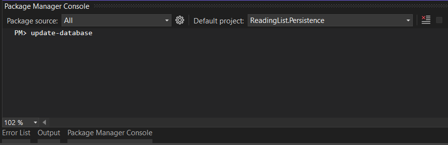

# ReadingList

ReadingList is an application, on which you can make your list of books, you want to store.
That list can be reorganized by changing its place in line or mark if it has been read.

## Installation

1.Change your connection string in appsettings.json

```bash
"ConnectionStrings": {
    "ReadingListConnectionString": "Server=.;Database=ReadingListDb;Trusted_Connection=True;TrustServerCertificate=True;"
  },
```

2. Initiate database



Run `update-database` command in Package Manager Console in Persistance project

## CORS Policy

Be sure your port is proper with origins rules placed in `Program.cs`.

```bash
builder.Services.AddCors(options =>
{
    options.AddDefaultPolicy(
        builder =>
        {
            builder.WithOrigins("https://localhost:3000", "http://localhost:3000")
                                .AllowAnyHeader()
                                .AllowAnyMethod();
        });
});
```

## Architecture

This is a web application, which uses Model-View-Controller (MVC) design patter.

Model part is supported by repository-service pattern, which contains businness logic with operations that should be performed by it.

Repository-Service pattern divides the business layer into two semi-layers. Repository handles getting data into and out of database.

Service is responsible for operations on data and passing them between repository and controller.

## Patterns/Technologies:

-ASP.NET Core
-Entity Framework
-Repository Pattern
-Fluent Validation
-AutoMapper

## Client

User interface is created with usage of React, a JavaScript library.

## About

Solbeg 4th Task
